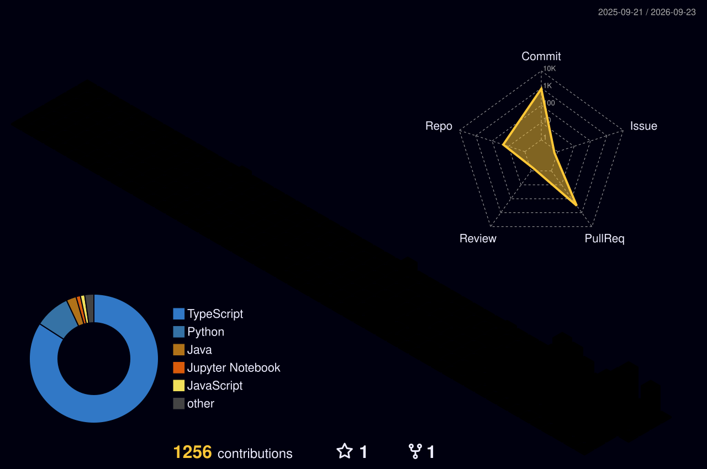

<!--
  ─────────────────────────────────────────────────────────────
  GitHub Profile README — Muhammad Salman Khan (@salmankhan-1106)
  Repo required: github.com/salmankhan-1106/salmankhan-1106
  ─────────────────────────────────────────────────────────────
-->

<!-- ══════════════ HEADER WAVE ══════════════ -->


<!-- ══════════════ TYPING ANIMATION ══════════════ -->
<div align="center">

[](https://salmankhan-1106.github.io/Portfolio/)

<!-- ══════════════ BADGE ROW ══════════════ -->


<a href="https://github.com/salmankhan-1106?tab=followers"></a>
<a href="https://salmankhan-1106.github.io/Portfolio/"></a>

</div>

<br/>

<!-- ══════════════ ABOUT ══════════════ -->


###  &nbsp;About Me

```yaml
name: Muhammad Salman Khan
role: AI Developer @ EHB Technologies
focus:
  - LLM integration & fine-tuning
  - Machine learning pipelines
  - CI/CD + MLOps automation
learning: [Speech-to-Text, TensorFlow, Model Distillation]
reach_me: m.salmankhan1106@gmail.com
fun_fact: "I debug faster at 2 AM ☕"
```

- 🔭 &nbsp;Currently working on **LLM fine-tuning & integration** at **EHB Technologies**
- 🌱 &nbsp;Currently learning **Speech-to-Text** and advanced **TensorFlow**
- 👨‍💻 &nbsp;All my projects live at **[my portfolio](https://salmankhan-1106.github.io/Portfolio/)**
- 💬 &nbsp;Ask me about **LLMs, RAG, fine-tuning, Docker, Kubernetes**
- 📫 &nbsp;Reach me at **m.salmankhan1106@gmail.com**

<br clear="right"/>

<!-- ══════════════ CONNECT ══════════════ -->
<div align="center">

### 🤝 &nbsp;Connect With Me

<a href="https://www.linkedin.com/in/muhammad-salman-khan-2110r2006"></a>
<a href="mailto:m.salmankhan1106@gmail.com"></a>
<a href="https://salmankhan-1106.github.io/Portfolio/"></a>
<a href="https://github.com/salmankhan-1106"></a>

</div>


<!-- ══════════════ TECH STACK ══════════════ -->
<div align="center">

## 🛠️ &nbsp;Tech Stack

<details open>
<summary><b>🧠 &nbsp;AI / Machine Learning</b></summary>
<br/>

<br/><br/>


</details>

<details open>
<summary><b>⚙️ &nbsp;Backend & Languages</b></summary>
<br/>

</details>

<details open>
<summary><b>🚀 &nbsp;DevOps & Cloud</b></summary>
<br/>

</details>

<details open>
<summary><b>🗄️ &nbsp;Databases & Frontend</b></summary>
<br/>

</details>

</div>


<!-- ══════════════ STATS ══════════════ -->
<div align="center">

## 📊 &nbsp;GitHub Stats


<br/><br/>


<br/><br/>


</div>

<!-- ══════════════ TROPHIES ══════════════ -->
<div align="center">

## 🏆 &nbsp;Trophies


</div>

<!-- ══════════════ 3D CONTRIBUTION CALENDAR ══════════════ -->
<div align="center">

## 🌆 &nbsp;My Contributions in 3D



</div>


<!-- ══════════════ QUOTE ══════════════ -->
<div align="center">


<br/>

⭐ &nbsp;**From [salmankhan-1106](https://github.com/salmankhan-1106) — thanks for stopping by!**

</div>

